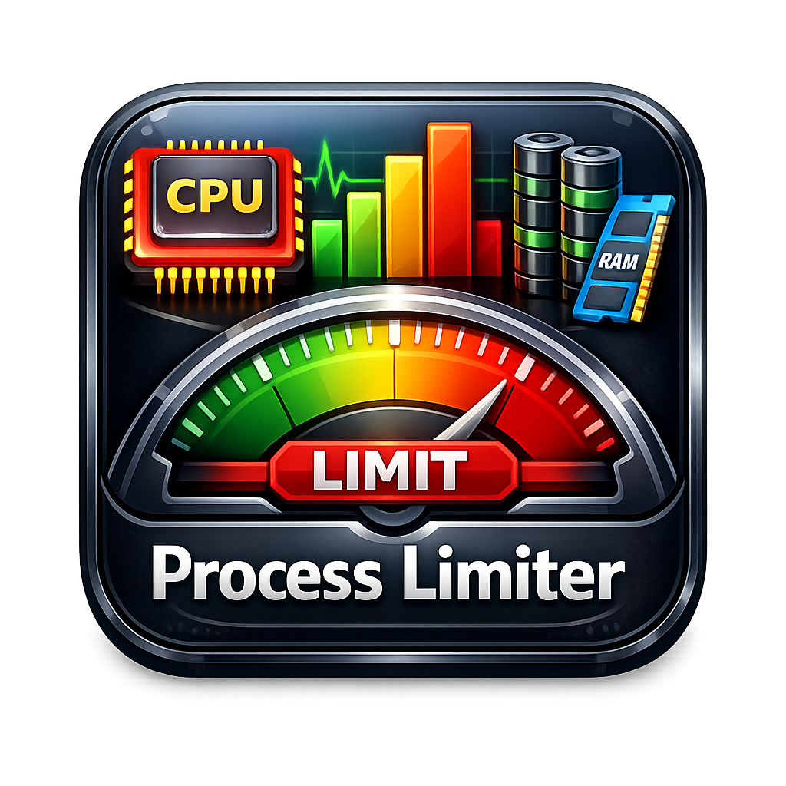

<p align="center">
  
</p>

<h1 align="center">PLimit — Process Limiter</h1>

<p align="center">
  A lightweight Windows utility to manage and fine-tune running process priorities, CPU affinity, I/O priority, CPU boost, thread priority boost, and efficiency mode — all from a clean dark-themed UI.
</p>

---

## Requirements

- Windows 10 / 11 (64-bit)
- [.NET 8.0 Desktop SDK for compile](https://dotnet.microsoft.com/en-us/download/dotnet/8.0)
- **Run as Administrator** (required to modify process settings)

---

## Getting Started

1. Download the latest release from the [Releases](../../releases) page.
2. Extract and run `PLimit.exe` **as Administrator**.
3. The process list loads automatically on startup.

> **Note:** Administrator privileges are required to change priority, affinity, or efficiency mode for most system processes.

---

## Features

### 🔍 Process List & Search
- Displays all currently running processes with their name and PID.
- Use the **search box** to filter by process name or PID in real time.

### ⚡ CPU Priority
Right-click a process to set its CPU scheduling priority:

| Level | Description |
|---|---|
| **Real Time** | Highest possible — use with caution, can freeze the system |
| **High** | Above most processes; good for foreground apps |
| **Above Normal** | Slightly elevated over standard processes |
| **Normal** | Default Windows priority |
| **Below Normal** | Deprioritised; runs after normal processes |
| **Idle** | Only runs when the CPU is otherwise idle |

### 💾 I/O Priority
Control disk access priority for a process:
- **High** — Prioritised disk access
- **Normal** — Default disk access
- **Low** — Throttled disk access
- **Very Low** — Minimal disk access (background tasks)

### 🧩 CPU Affinity
Restrict a process to specific CPU cores via the right-click context menu. At least one core must remain enabled.

### 🚀 CPU Boost
Enable or disable dynamic CPU frequency boost for a selected process.

### 🧵 Thread Priority Boost
Read and control the **dynamic thread priority boost** for a selected process.

When enabled (Windows default), the kernel temporarily raises a thread's base priority after it wakes from a wait (e.g. after I/O or a UI event) to improve responsiveness. Disabling it keeps all threads pinned to their base priority — useful for latency-sensitive workloads or real-time scenarios where predictable scheduling matters more than burst responsiveness.

| Action | Description |
|---|---|
| **Read** | Returns `true` if boost is active, `false` if disabled, or `null` if the status cannot be queried (access denied) |
| **Enable** | Restores the default Windows behaviour — threads receive a temporary priority boost after waiting |
| **Disable** | Prevents any dynamic boost — threads always run at their assigned base priority |

### 🌿 Efficiency Mode
Toggle Windows **EcoQoS** (Efficiency Mode) on or off for a process. Efficiency Mode reduces CPU and power usage — ideal for background apps.

### 📊 System Monitor
A live bar graph at the bottom of the window shows:
- **Per-core CPU usage** — colour turns red above 90%
- **RAM usage** — displays used/total (GB or MB), colour turns red above 85%

---

## Settings

| Option | Description |
|---|---|
| **Save Settings** | Persists your priority/affinity/boost/efficiency/I/O choices to `Settings/processes.json` |
| **Load Settings on Startup** | Automatically re-applies saved settings when PLimit launches |

Settings are stored in `Settings/processes.json` next to the executable.

---

## Building from Source

```bash
# Clone the repository
git clone https://github.com/your-username/PLimit.git
cd PLimit

# Build
dotnet build PLimit.sln -c Release
```

The output is placed in `PLimit\bin\Release\net8.0-windows\`.

---

## License

See [LICENSE.txt](LICENSE.txt) for details.

## Screenshot


